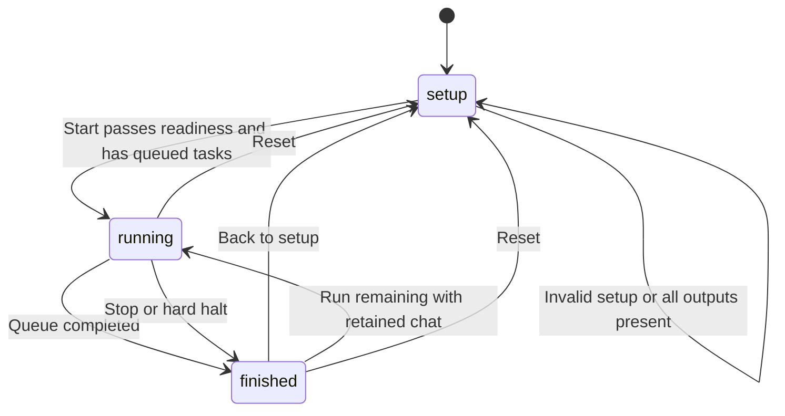

# Dual-platform image generation specification

This contract defines OmniImageAutoGen 0.1.0: one platform per run, serial tasks in one session, scoped native downloads and verified output under platform subdirectories.

## 1. Scope and invariants

- Supported platforms are ChatGPT and Gemini; automation uses the user's logged-in browser.
- A run selects one platform and one new/existing session. Only the active tab supplies account context.
- Prompt strings are sent unchanged; no ratio line or other prompt text is appended.
- UI uses native TypeScript/DOM/CSS, English/Chinese, system theme and locally bundled fonts.
- Directory handles and existing setting names/defaults retain compatibility.
- Output lookup and task identity compare safe filenames without case sensitivity.
- Download association uses a pre-click directory baseline and file modification time. It does not use the Chrome downloads API.
- Source deletion for a successful save follows output verification. The existing previous-source SHA-256 duplicate guard is preserved.
- Reset clears local storage and cancels runtime work, retaining IDB handles and images.

Parallel platforms, models/quality controls, per-site settings, API keys, prompt/task editing, Pause/Resume, real thumbnails, ratio validation and cross-run hash databases are outside this contract.

## 2. Types

```ts
type PlatformId = "chatgpt" | "gemini";
type SessionMode = "new" | "existing";
type AspectRatio = "1:1" | "3:4" | "4:3" | "9:16" | "16:9";
type TaskItem = { name: string; prompt: string };
type StageId = "open-session" | "image-mode" | "send-prompt" | "generate" | "download" | "save";
type StageStatus = "todo" | "active" | "done" | "reused" | "skipped";
type TaskOutcome = "saved" | "skipped-exists" | "skipped-warning" | "failed";
```

Pure policies live in `src/utils/*.js` with matching `.d.ts`. TypeScript imports those policies with `.js` suffixes, and BDD tests import the same JavaScript implementation.

## 3. Platform and URL rules

| Platform | Label/badge/color | Host | Chat hint | Default home |
| --- | --- | --- | --- | --- |
| `chatgpt` | ChatGPT / C / #0E6E5C | `chatgpt.com` | `/c/…` | `https://chatgpt.com/` |
| `gemini` | Gemini / G / #5B3FD0 | `gemini.google.com` | `/app/…` | `https://gemini.google.com/app` |

`detectPlatform(url)` returns ChatGPT for exact `chatgpt.com`, Gemini for exact `gemini.google.com` or a host ending in `.gemini.google.com`, and null otherwise, including invalid URLs.

`getGeminiAccountPrefix(url)` reads pathname `^/u/(\d+)(/|$)` and returns `/u/<n>` or empty string. No account number is hardcoded.

After removing Gemini's account prefix and one trailing slash, a conversation path matches `^/app/[A-Za-z0-9_-]+$`. ChatGPT conversation paths match `^(/g/[^/]+)?/c/[A-Za-z0-9-]+$` after removing a trailing slash. The URL's detected platform must match the selected platform.

Gemini home paths after removing the account prefix are `/app`, `/app/` and `/`. ChatGPT home paths are `/` or empty. Home/conversation classification ignores query/hash.

`buildHomeUrl("gemini",activeTabUrl)` uses `https://gemini.google.com<account prefix>/app` only when the active tab detects as Gemini; otherwise it uses default home. ChatGPT always uses its default home.

`validateSessionUrl(url,platform,t)` checks in this order:

1. Empty/whitespace: `empty`.
2. Invalid URL: `invalid`.
3. Unrecognized/different platform: `wrong-platform`, with `detectedPlatform`.
4. Home route: `home`.
5. Any other non-chat route: `not-conversation`.
6. Success: `{ok:true,platform,accountPrefix}`.

Failure is `{ok:false,code,message,detectedPlatform?}`; message comes from i18n. `normalizeSessionUrl` compares origin plus pathname with trailing slash removed, ignoring query/hash. `sessionUrlsMatch` compares those normalized values.

## 4. Tasks, prompt and paths

`validateTasks(raw)` returns `{fatal:"not-array"}` for a non-array, otherwise `{tasks,issues,total}`.

Each item may produce multiple issues, in this order:

1. Null, arrays and primitives: `not-object`.
2. Missing/non-string name: `name-missing`; blank trimmed name: `name-empty`.
3. Missing/non-string prompt: `prompt-missing`; blank trimmed prompt: `prompt-empty`.
4. Apply the unchanged `toSafeTaskFilename` rule. Uppercase the base before its first period; CON, PRN, AUX, NUL, COM1–COM9 and LPT1–LPT9 produce `name-reserved`.
5. Compare the safe name lowercased. Second and later occurrences produce `name-collision`, pointing to the first source index.

Issue shape is `{index,code,field?,name?,otherIndex?}`; indices are 1-based. Invalid items are excluded from tasks. Valid tasks keep original name/prompt strings and order; extra fields are discarded. Setup marks both members of a collision as problems and blocks Start while any issue exists.

```js
composeTaskPrompt(safeName, prompt) // "name: " + safeName + "\nprompt: " + prompt
promptAnchor(safeName)             // "name: " + safeName
platformSubdir(platform)           // "chatgpt" or "gemini"
taskKey(platform, name)            // platform + ":" + toSafeTaskFilename(name).toLowerCase()
```

Output is `<output handle>/<platform>/<safe filename>`. UI displays `handle.name`, never a full filesystem path. Thumbnail UI remains a placeholder.

## 5. Storage and migration

### Local storage keys

| Key | Type/default | Purpose |
| --- | --- | --- |
| `uiLanguage` | `en` or `zh`; default `en` | Interface language for panel and options |
| `logCollapsed` | boolean; default true | Setup view log panel visibility |
| `loadedTasksRaw` | raw JSON array | Raw tasks from loaded file |
| `loadedTasks` | validated `{name,prompt}[]` | Validated task array; extra fields stripped |
| `loadedTasksFileName` | string | Name of the loaded JSON file |
| `ui_platform` | `chatgpt` or `gemini`; default `gemini` | Currently selected platform |
| `ui_sessionMode` | `new` or `existing`; default `new` | Selected session mode |
| `sessionUrl_chatgpt`, `sessionUrl_gemini` | string | Per-platform chat URL (manual or captured) |
| `settings_aspectRatio` | `1:1`, `3:4`, `4:3`, `9:16`, `16:9`; default `16:9` | Gemini page ratio; ChatGPT uses prompt |
| `sourceSubfolder`, `outputSubfolder` | string | Cached directory name (`handle.name`) |
| `custom_warning_patterns` | string[]; default []; max 50 | Custom reply warning patterns |
| `currentTask` | TaskItem or null | Active task item |
| `currentTaskMode` | `full` or `download-only` | Attempt mode |
| `currentTaskIndex` | number | Queue index of current task |
| `currentTaskRunSeq` | number | Monotonic attempt sequence identifier |
| `currentTaskPlatform` | PlatformId | Platform of active task |
| `currentSessionUrl` | string | Locked chat URL (empty while pending) |
| `currentSessionPending` | boolean | Whether new session link is awaiting capture |
| `currentHomeUrl` | string | Home URL opened for new session |
| `currentTaskAttempt` | number; starting at 1 | Attempt counter for current task |

### Timing and retry defaults

All timing values are seconds; retry/failure values are counts.

| Key | Default | Purpose |
| --- | ---: | --- |
| `settings_generationTimeout` | 120 | Maximum wait for generated image to appear |
| `settings_downloadTimeout` | 120 | Maximum wait from download click to verified save |
| `settings_pageLoadTimeout` | 30 | Wait for chat page and history to settle |
| `settings_inputTimeout` | 5 | Wait for composer prompt box to be ready |
| `settings_stepDelay` | 1 | Pause between page actions |
| `settings_taskInterval` | 5 | Pause between consecutive tasks |
| `settings_pollInterval` | 1 | Polling interval for readiness and status checks |
| `settings_maxRetries` | 3 | Retries per image before marking as failed |
| `settings_maxConsecutiveFailures` | 5 | Consecutive failures before stopping (0 = never stop) |

### Migration and directories

If `lockedConversationUrl` exists and is a valid Gemini chat, migration sets Gemini/existing mode and `sessionUrl_gemini`, then removes the old key. If a new Gemini session key already exists, it is not overwritten and only the old key is removed. Invalid old values are only removed; absence is a no-op.

IndexedDB database is `GeminiAutoGenDB`, version 4, object store `handles`, keys `sourceHandle` and `outputHandle`. Reset preserves these handles and existing output files. Status queries call `queryPermission({mode:"readwrite"})` without prompting; user-initiated **Allow again** requests access.

## 6. Platform adapter interface and DOM selectors

```ts
interface PlatformAdapter {
  id: PlatformId;
  isPageReady(): { ready: boolean; details: Record<string, unknown> };
  waitHistorySettled(timeoutMs: number, stepDelayMs: number): Promise<void>;
  scrollToBottom(stepDelayMs: number): Promise<void>;
  ensureImageMode(stepDelayMs: number): Promise<"ok" | "not-found">;
  ensureAspectRatio?(ratio: AspectRatio, stepDelayMs: number): Promise<"ok" | "not-found">;
  findComposer(): HTMLElement | null;
  writePrompt(text: string, stepDelayMs: number): Promise<boolean>;
  getSendButton(): HTMLButtonElement | null;
  getStopButton(): HTMLButtonElement | null;
  snapshotUserMessages(): Element[];
  listUserMessages(): Element[];
  userMessageText(element: Element): string;
  getReplyScope(userMessage: Element): Element | null;
  readReplyState(userMessage: Element): ReplyState;
  findReplyByAnchor(anchor: string): { userMessage: Element } | null;
  triggerDownload(userMessage: Element, stepDelayMs: number): Promise<void>;
  afterDownload(stepDelayMs: number): Promise<void>;
  replyText(userMessage: Element): string;
}
type ReplyState = {
  scopeFound: boolean;
  busy: boolean;
  complete: boolean;
  hasLoadedImage: boolean;
  downloadReady: boolean;
  hasAnyImageNode: boolean;
};
```

### DOM selector contracts

#### Gemini

| Purpose | Primary contract |
| --- | --- |
| Composer | `.ql-editor.textarea[contenteditable="true"]`, with scoped editor/textbox fallbacks |
| Page ready | Document complete, visible composer and chat container/main, no visible loading spinner |
| Image mode | `button[aria-label="Upload & tools"]` (with localized `上传和工具` / `工具` fallbacks); Create image `button[role="menuitemcheckbox"]` (`Create images` / `创建图片` / `生成图片`) |
| Selected image mode | Visible `button[aria-label="Deselect Images"]` or menu item's `aria-checked="true"` |
| Ratio | `button[aria-label^="Aspect ratio"]` / `button[aria-label^="宽高比"]`; option `[role="menuitemradio"]` matching ratio via regex `/\b(1:1|3:4|4:3|9:16|16:9)\b/` |
| Send/stop | `Send message` / `Stop response` aria labels (with localized `发送消息` / `停止回答` fallbacks), with existing button fallbacks |
| User and reply | `user-query` and its closest `.conversation-container` |
| Generation | Reply's `model-response [aria-busy="true"]`, footer complete, loaded generated image |
| Download | Current container's `button[aria-label="Download full size image"]` (with `下载全尺寸图片` / `下载原图` fallbacks), with specific download-component fallbacks |

#### ChatGPT

| Purpose | Primary contract |
| --- | --- |
| Composer | `div.ProseMirror[contenteditable="true"]`, with composer textbox fallbacks |
| Image mode | Tools `button[aria-label="Add files and more"]` (with localized `添加文件等内容` / `附件` fallbacks); Create image `button[data-list-navigation-item]` (`Create image` / `创建图片`) |
| Selected image mode | Composer's `[data-inline-selection-pill][data-system-hint-type="picture_v2"]` |
| Send/stop | `button[aria-label="Send prompt"]` / `button[aria-label="Send"]` (localized `发送提示` / `发送`); stop `button[aria-label="Stop streaming"]` / `button[aria-label="Stop"]` (localized `停止`) |
| User message | `[data-user-message-bubble]`, read using `innerText` |
| Assistant markers | `h4[data-conversation-role="assistant"]`; blocks after the bound user and before the next user |
| Completion | Last paired turn's `data-talvt-turn-state="complete"` |
| Generated image | Paired blocks' `[data-testid="generated-image-preview"] img` |
| Viewer | A `[role="dialog"]` titled **Image preview** or **图片预览** |
| Viewer download/close | That dialog's `button[aria-label="Download"]` / `button[aria-label="下载"]` and `button[aria-label="Close"]` / `button[aria-label="关闭"]` / `button[aria-label="Close viewer"]` |

### Interaction invariants

- Capture user-message element references before sending; never click Send again after acknowledgment.
- Bind the reply to the name anchor, and choose the last matching user message for download-only retry.
- ChatGPT prompt insertion preserves the composer image pill using paste events with insertText fallback.
- Loaded generated images have positive natural dimensions; unloaded nodes do not satisfy download readiness.
- Arm the source baseline before clicking a native download once per attempt.
- Adapters include bilingual English and Chinese selector fallbacks for primary buttons and dialogs.

## 7. Runtime messages

Every request includes its action. Task-originated reports/requests include `taskIndex,taskRunSeq`.

| Action | Direction | Request fields | Response |
| --- | --- | --- | --- |
| `CHECK_FILE_EXISTS` | Content/panel → background | platform, filename | exists, or error/type |
| `LIST_ALL_FILES` | Panel → background | platform | files:string[] |
| `FOLDER_STATUS` | Panel → background | none | source/output name? and state |
| `DOWNLOAD_ARM` | Content → background | platform, targetFilename, taskIndex, taskRunSeq | ok+armId, or error/type |
| `WAIT_AND_SAVE` | Content → background | armId | success+filename, or error/type/cancelled? |
| `DOWNLOAD_CANCEL` | Panel → background | reason | ok:true |
| `TASK_STAGE` | Content/background → panel | stage, status, meta?, taskIndex, taskRunSeq | none |
| `LOG` | Content → background | level, message, data?, source, event?, verbose?, scope | ok:true |
| `PANEL_LOG` | Background → panel | same log fields plus timestamp | none |
| `OPEN_OPTIONS` | Panel → background | none | Opens Options |
| `RESET_STATE` | Panel/Options → background | none | Cancels arm and resets hash |
| `RELOAD_WARNING_PATTERNS` | Panel → platform tabs | none | Reloads custom rules |
| `TASK_COMPLETE` | Content → panel | skipped, skipReason?:exists/warning, warningExcerpt?, scope | none |
| `TASK_ERROR` | Content → panel | error, errorType?, scope | none |
| `UPDATE_STATUS` | Content → panel | status, isError?, scope | none |

Folder state is `granted | prompt | denied | missing`. File/list lookup operates in the platform subdirectory without creating a missing one. Folder status reads do not request permission.

Errors classify as `folder` for authorization, `download` for transfer/save failures, `generation` for generation/reply failures, and `locked-url` for session mismatch.

## 8. Download algorithm

An active arm contains id, platform, targetFilename, task scope, baseline image-name set, armedAt and aborted flag. Only one arm and one wait are active.

### Arm

1. Validate the request against current stored task scope.
2. Abort an older arm and wait for any save cleanup to finish.
3. Recheck scope/cancellation generation; resolve authorized source/output handles.
4. Snapshot top-level source PNG/JPG/JPEG/WebP filenames.
5. Store arm timestamp and reply `{ok:true,armId}`; only then may content click.

### Wait and save

The deadline is arm time plus download timeout. Poll using current unified/legacy fallback interval:

1. Check cancellation and call `chrome.runtime.getPlatformInfo()` each round for service-worker activity.
2. Read eligible top-level image entries and select a filename outside baseline with `lastModified >= armedAt - 2000`.
3. Choose maximum lastModified, then maximum filename as tie-breaker; no candidate means continue.
4. Report save active. Require three equal positive file-size readings, within the same deadline.
5. Read bytes and decode. A decode failure returns to scanning.
6. SHA-256 equal to the previous successful source deletes the duplicate source and returns generation failure.
7. Target MIME is JPEG for jpg/jpeg extension, PNG otherwise. Source magic identifies PNG (89 50 4E 47), JPEG (FF D8 FF), or RIFF/WEBP.
8. Copy equal formats. Otherwise use OffscreenCanvas with target MIME; JPEG quality is 0.95.
9. Write and close under the selected platform subdirectory.
10. Verify positive output size, target magic and successful decoding.
11. Check cancellation/deadline, delete source, update last hash, report save done and return success.

Cancelled/failed attempts abort writing and remove a newly created target if it was never verified. Source remains, except for the preserved duplicate-source guard. Verified output is retained. A next arm waits for old cleanup before reusing the name.

Timeout returns download error. Folder-auth exceptions return folder error; other pipeline exceptions return download error. Cancel and Reset abort the arm; Reset also clears the hash.

## 9. UI and runtime state



### Setup readiness

Readiness issues have fixed priority order: `session`, `prompts`, `source`, `output`:

- **session**: existing mode and invalid session URL (new mode ignores URL).
- **prompts**: missing file, fatal parse/shape error, any item issue or empty task queue.
- **source** / **output**: permission state is not `granted`.

Start opens/reuses the selected session, filters existing files and stays in setup if nothing remains. A new-session URL update captures the platform chat and persists existing mode for the next run. The first non-skipped completion retries capture once via tab lookup; failure halts.

### Retry policy

| Error condition | Recovery decision |
| --- | --- |
| Session URL mismatch (`locked-url`) | Halt immediately |
| Folder authorization error (`folder`) | Halt immediately |
| Download/save error with captured session | Retry download-only (reuse reply) |
| Download/save error with pending session | Retry full task |
| Generation/prompt failure | Retry full task |
| Retries exhausted, within failure cap | Mark failed and advance to next task |
| Retries exhausted, consecutive failure cap reached | Halt run (`fail-stop`) |

### Watchdog budget

- Full attempt: `generationTimeout + downloadTimeout + 15s`.
- Download-only attempt: `downloadTimeout + 15s`.
- Watchdog expiry marks task failure and advances without normal retry.

### Stop, Reset, and Finish

- **Stop**: cancels downloads, increments sequence, invalidates content, and displays stopped summary.
- **Hard halt**: displays halt cause and suggested user recovery action.
- **Finish**: persists captured conversation URL and refreshes output directory for remaining work.
- **Reset**: cancels timers, clears `chrome.storage.local`, sends `RESET_STATE`, and keeps IDB handles and output files.

## 10. Validation boundary

Pure policy BDD tests and required typecheck/build gates are committed. UI preview screenshots and browser/filesystem fixtures are local executor evidence. Authenticated real-site runs, non-English website controls, ChatGPT frontend paste compatibility and long service-worker behavior require manual acceptance; see [testing and quality](../testing-and-quality.md).

