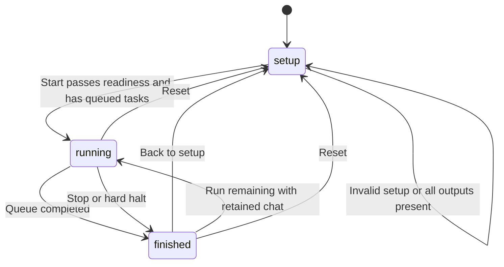

# Runtime state machines

## Panel views

View is `setup | running | finished`. Finished run outcomes are `finished | stopped | halted`; the running outcome is `running`. Setup readiness distinguishes Ready and Not ready without introducing another view.

## Tasks and stages

Tasks record `saved | skipped-exists | skipped-warning | failed`. Results are indexed by queue position; retry counters use platform plus case-insensitive safe name.

Stage IDs are `open-session,image-mode,send-prompt,generate,download,save`. Each stores status `todo | active | done | reused | skipped`, timestamps and optional metadata.

A new active stage completes the previous active stage. Download-only recovery reuses image mode, send and generation as appropriate. New task processing resets stages, keeping the measured open-session stage.

## Session state

`new -> pending -> captured`: open the computed home URL, capture a specific chat route after send, then lock subsequent tasks to that URL. Existing mode starts with a validated URL and no pending capture.

If a download fails while pending, the next attempt is full. Once captured, download-only recovery can reuse the reply. Missing capture after the first non-skipped completion is a hard halt.

## Run transitions

Completion is scoped to the active index/sequence. Saved completion also requires an output post-check. Accepted results reset consecutive failures and advance.

Normal errors choose full/download-only retry, fail-next or fail-stop through the existing retry policy. Session and folder errors halt immediately. A watchdog expiry fails the current task and advances without a normal retry.

Stop cancels downloads, increments sequence, invalidates content and preserves results. Reset cancels work and clears local state; external reset avoids recursive clearing. Delayed async transitions recheck run identity before mutating state.

## Download arm

`unarmed -> armed -> waiting -> candidate -> stable -> decoded -> written -> verified -> saved`

- Arm records the pre-click baseline and timestamp.
- Waiting and stabilization share the download deadline.
- A temporary decode failure returns to waiting.
- Cancellation invalidates the arm and aborts writing.
- Failure/cancellation cleans newly created unverified output before another arm reuses its name.
- Verified success removes source and updates the previous-image hash.
- Duplicate source hash fails as generation under the preserved duplicate guard.

The active arm has one wait. A new arm cancels the old arm, waits for cleanup and rechecks task scope.
